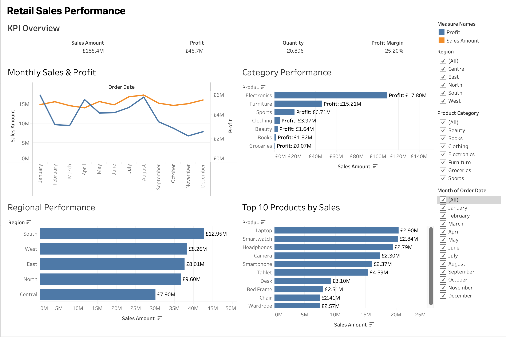

Retail Sales Analysis & Dashboard
An end-to-end data analysis project: cleaning a raw retail sales dataset with Python, exploring it with SQL, visualizing trends with matplotlib, and building an interactive Tableau dashboard to surface sales, profitability, and regional performance.
Overview
I took a retail sales dataset through the full analytics pipeline — from messy raw data to a decision-ready dashboard:
Clean — handle missing values, invalid ages/quantities, and duplicates in Python (pandas)
Query — explore customer, product, sales, and operations questions in SQL
Visualize — build exploratory charts in matplotlib
Dashboard — assemble an interactive Tableau dashboard for at-a-glance business insight
Key Insights
£185.4M in total sales and £46.7M in profit, a 25.2% overall profit margin, across 20,896 units sold
Electronics is the strongest category by profit (~£17.8M), ahead of Furniture (~£15.2M) and Sports (~£6.7M)
South is the top-performing region by sales, ahead of North, West, East, and Central
Best-selling individual products are the Laptop, Smartwatch, and Headphones
Monthly sales and profit move differently through the year — sales peak early and late, while profit holds a steadier mid-year climb, which is worth digging into further (discounting patterns, seasonal costs)
Tools & Tech Stack
Stage	Tool
Data cleaning	Python (pandas)
Data storage / querying	SQL (SQLite)
Exploratory visualization	Matplotlib
Interactive dashboard	Tableau
Repository Structure
retail-sales-dashboard/
├── data/                        # Cleaned dataset
│   └── retail_sales_cleaned.csv
├── python/                      # Data cleaning & analysis scripts
│   ├── cleaning.py              # Raw data → cleaned dataset
│   ├── analysis.py
│   ├── create_database.py       # Loads cleaned data into SQLite
│   ├── main.py
│   └── visualisation.py         # Matplotlib charts
├── sql/                         # SQL analysis queries
│   ├── 01_customer_analysis.sql
│   ├── 02_product_analysis.sql
│   ├── 03_sales_analysis.sql
│   ├── 04_operations_analysis.sql
│   └── retail_sales.db
├── images/                      # Dashboard screenshots
│   └── dashboard.png
├── requirements.txt
└── README.md
Data Cleaning
The raw dataset came in with missing order dates, invalid ages and quantities, and duplicate rows. The cleaning script:
Removes duplicate orders
Drops rows with missing order_date (267 rows)
Validates age and quantity fall within realistic ranges
Produces a final, analysis-ready dataset of 3,933 orders across 21 columns, with zero remaining nulls
Dashboard

The dashboard is built around one flagship view — Retail Sales Performance — with:
KPI row: total sales, profit, quantity sold, and profit margin
Monthly Sales & Profit: dual-axis trend line across the year
Category Performance: sales and profit broken out by product category
Regional Performance: sales by region
Top 10 Products by Sales: best-selling individual products
Filters: Region, Product Category, and Month, all linked across every chart
An interactive Tableau Public version is on the way — screenshot above for now.
How to Run This Project
bash
# Clone the repo
git clone https://github.com/ertugrultatar/retail-sales-dashboard.git
cd retail-sales-dashboard

# Set up the environment
python -m venv .venv
source .venv/bin/activate       # Windows: .venv\Scripts\activate
pip install -r requirements.txt

# Reproduce the cleaned dataset
python python/cleaning.py

# Load it into SQLite and run the analysis queries
python python/create_database.py

# Generate the matplotlib charts
python python/visualisation.py
The Tableau dashboard connects directly to data/retail_sales_cleaned.csv — open the workbook in Tableau Public/Desktop to explore it interactively.
Data Source
Retail sales dataset sourced from Kaggle.
Contact
Ertugrul Tatar Linkedin: https://www.linkedin.com/in/ertugrultatar/