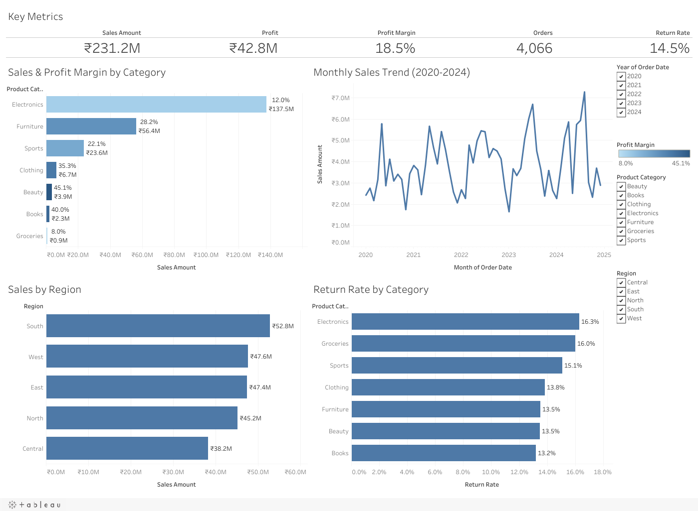

# Retail Sales Analysis & Dashboard

An end-to-end data analysis project: cleaning a raw retail sales dataset with Python, exploring it with SQL, visualizing trends with matplotlib, and building an interactive Tableau dashboard to surface sales, profitability, and regional performance.

## Overview

I took a retail sales dataset through the full analytics pipeline — from messy raw data to a decision-ready dashboard:

1. **Clean** — handle missing values, invalid ages/quantities, and duplicates in Python (pandas)
2. **Query** — explore customer, product, sales, and operations questions in SQL
3. **Visualize** — build exploratory charts in matplotlib
4. **Dashboard** — assemble an interactive Tableau dashboard for at-a-glance business insight

## Key Insights

All amounts are in Indian Rupees (₹) — the dataset covers orders across Indian cities from 2020 to 2024.

- **₹231.2M** in total sales and **₹42.8M** in profit, an **18.5%** overall profit margin, across **4,066** orders and **22,373** units sold
- **Electronics drives 59% of sales (₹137.5M) but only earns a 12% margin.** Furniture brings in less than half the revenue (₹56.4M) yet nearly the same profit (₹15.9M vs ₹16.6M) at a 28% margin
- **Groceries contribute almost nothing** — ₹0.87M in sales for ₹0.07M profit (8% margin)
- **Sales are seasonal: Q2 and Q3 are ~50% bigger than Q1 and Q4** (₹69M vs ₹46M), and this holds in every year from 2020 to 2024. Order counts are similar each quarter — the peak comes from higher-value purchases, while the margin stays flat at ~18.5%
- **Discounts don't erode margin** — orders with 30–40% discounts earn the same ~18.5% margin as orders with under 10%
- **South** is the top region (₹52.8M), and **Central** the weakest (₹38.2M)
- **14.5% of orders are returned**, highest for Electronics (16.3%)

### Recommendations

1. **Grow Furniture** — it earns more than twice Electronics' margin per ₹ of sales, so marketing spend there returns more profit
2. **Review Electronics pricing and returns** — it's the biggest category, but has the thinnest margin (outside Groceries) and the highest return rate
3. **Plan stock and staffing around the Q2–Q3 peak**, and use Q1/Q4 for promotions to smooth demand
4. **Reassess Groceries** — at an 8% margin it adds volume but almost no profit

## Tools & Tech Stack

| Stage | Tool |
|---|---|
| Data cleaning | Python (pandas) |
| Data storage / querying | SQL (SQLite) |
| Exploratory visualization | Matplotlib |
| Interactive dashboard | Tableau |

## Repository Structure

```
retail-sales-dashboard/
├── data/                        # Cleaned dataset
│   └── retail_sales_cleaned.csv
├── python/                      # Data cleaning & analysis scripts
│   ├── main.py                  # Runs the full pipeline end to end
│   ├── cleaning.py              # Raw data → cleaned dataset
│   ├── create_database.py       # Loads cleaned data into SQLite
│   ├── analysis.py              # Summary tables (pandas)
│   └── visualisation.py         # Matplotlib charts → images/
├── sql/                         # SQL analysis queries
│   ├── 01_customer_analysis.sql
│   ├── 02_product_analysis.sql
│   ├── 03_sales_analysis.sql
│   └── 04_operations_analysis.sql
├── images/                      # Dashboard screenshot & generated charts
│   └── dashboard.png
├── requirements.txt
└── README.md
```

## Data Cleaning

The raw dataset (4,310 rows) came in with blank rows, invalid placeholder values (negative ages, age `999`, quantity `999`), inconsistent casing (`delivered` vs `Delivered`), mixed date formats, and duplicate rows. The cleaning script:

- Removes blank rows and orders missing an `order_id` or `customer_id`
- Treats impossible values as missing (ages ≤ 0 or > 120, quantity ≤ 0 or `999`, negative shipping costs)
- Drops orders with no valid quantity (136 rows) rather than guessing a value
- Fills other gaps with `Unknown` (text) or the median (numbers)
- Parses mixed date formats, standardises text casing, and removes 78 duplicate rows
- Runs validation checks (no nulls, valid ranges, profit never exceeds sales, unique order IDs) before saving

**Result:** 4,066 analysis-ready orders across 21 columns.

> **Note:** `sales_amount` in the source doesn't equal `quantity × unit_price × (1 − discount)`. Because `profit` is derived from the source `sales_amount`, it's kept as provided — recalculating sales alone would make profit exceed sales on some orders.

## Dashboard

**[View the interactive dashboard on Tableau Public](https://public.tableau.com/app/profile/ertugrul.tatar/viz/RetailSalesPerformance_17911221081880/RetailSalesPerformance)**

[](https://public.tableau.com/app/profile/ertugrul.tatar/viz/RetailSalesPerformance_17911221081880/RetailSalesPerformance)

The **Retail Sales Performance** dashboard is built to answer the questions behind the key insights:

- **KPI row**: total sales, profit, profit margin, orders, and return rate
- **Sales & Margin by Category**: revenue bars with margin %, showing where the money is made versus where the profit is made
- **Monthly Sales Trend (2020–2024)**: month by month, showing the recurring Q2–Q3 peak
- **Sales by Region**: regional revenue ranking
- **Return Rate by Category**: which categories lose the most orders to returns
- **Filters**: Year, Region, and Product Category, linked across every chart

All amounts are in ₹.

Running the pipeline also saves matplotlib charts to `images/` (yearly sales, monthly sales vs profit, sales by category, top products).

## How to Run This Project

```bash
# Clone the repo
git clone https://github.com/ertugrultatar/retail-sales-dashboard.git
cd retail-sales-dashboard

# Set up the environment
python -m venv .venv
source .venv/bin/activate       # Windows: .venv\Scripts\activate
pip install -r requirements.txt

# Run the full pipeline: clean → SQLite → analysis → charts
python python/main.py
```

To explore the SQL queries, open `sql/retail_sales.db` (created by the pipeline) in any SQLite client and run the files in `sql/`.

The Tableau dashboard is built on `data/retail_sales_cleaned.csv` and published on [Tableau Public](https://public.tableau.com/app/profile/ertugrul.tatar/viz/RetailSalesPerformance_17911221081880/RetailSalesPerformance), where you can explore it or download the workbook.

## Data Source

Retail sales dataset sourced from Kaggle.

## Contact

**Ertugrul Tatar**
[LinkedIn](https://www.linkedin.com/in/ertugrultatar/)


